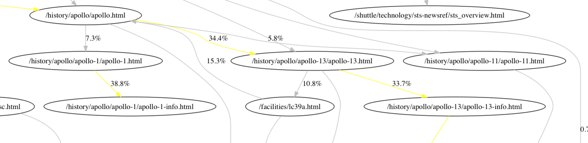

# Graphitty

[](https://circleci.com/gh/sketchytechky/graphitty)

[](https://coveralls.io/github/sketchytechky/graphitty?branch=master)

A Python library that convert time series to direction Graph to discover the story within data.





# Installing

To install this package, runs:

    pip install git+https://github.com/sketchytechky/graphitty.git

Remember to add the following line to `requirements.txt`

    git+https://github.com/sketchytechky/graphitty.git


-----------


# How to use

```
from graphitty.graphitty import Graphitty
import pandas as pd

# Example input data - see test_simple.py for example
df = pd.DataFrame(
        [...],
        columns=['timestamp','action', 'user_id'])

# Parsing and outputting graph
g = Graphitty(
    df,
    id_col='user_id',
    beahivour_col='action',
    ts_col='timestamp')
nx_graph = g.render()

# create the beautiful directional graph
# see https://github.com/chebee7i/nxpd for usage
import nxpd
nxpd.draw(nx_graph, show='ipynb')
```

# Running Tests

Run test with

    py.test --pep8

To run test in watch mode

    py.test.watch -- --pep8
    # same with: ptw -- --pep8


-----------


# Related research


* Information Foraging Theory:Adaptive Interaction with Information - http://www.peterpirolli.com/Professional/About_Me_files/IFT%20Ch%201.pdf


* Jakob Nielson example on how to apply information foraging theory to understand visitor's behaviour
  - http://www.useit.com/alertbox/scrolling-attention.html
  - https://www.nngroup.com/articles/information-scent/

